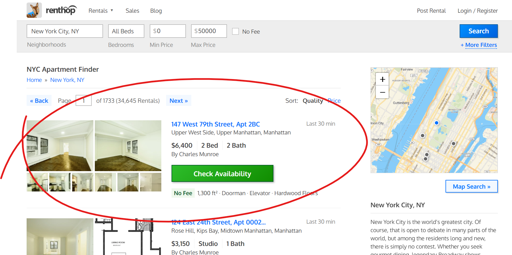
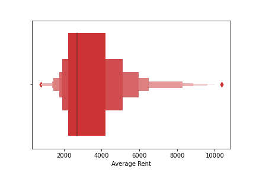
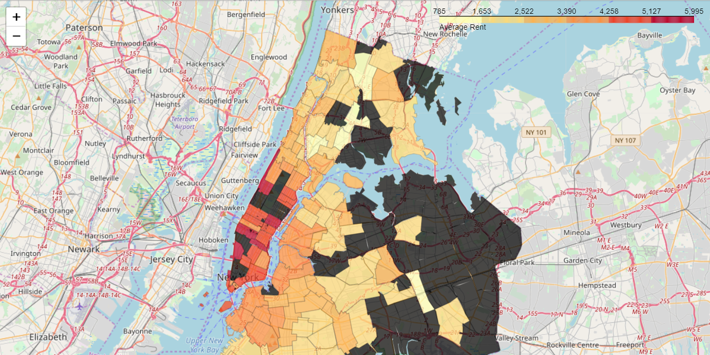
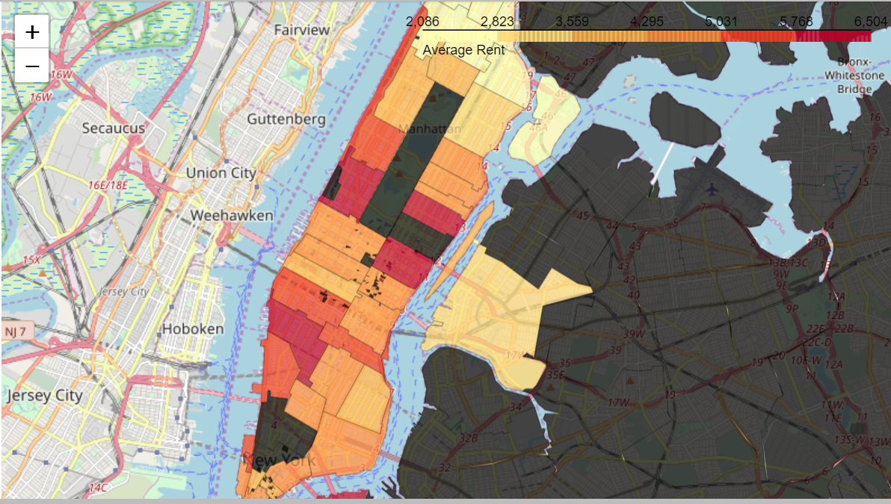

# Apartments-Listings-NYC-Analysis-and-Modeling

**IN PROGRESS!** 

# Find somewhere to lay your head in the city that never sleeps. Make better decision for affordable apartment hunt in NYC with data. 

## Introduction

For international students it is hard to manage their finances is USA. Especially, when your parents are not super rich and your are not allowed to work more then 20 hours a week. 

Affordable and convenient accommodation is a basic requirement to live in States. As my university is in NJ (Drew University, Madison NJ) and I planing to do summer internship in New York City. It would require me to move to NYC, as commuting from NJ would be a time consuming and less effective. Hence, I decided to support my decision for apartment hunt with data analysis and machine learning modeling. 

For understating of NYC neighborhoods: Read [here](https://www.moneyunder30.com/renting-in-nyc).

## Data Source

My first concern was how can I get the data for such analysis?
Well, I decided to scrap web for gathering relevant data. Most websites (like listed below) have strict rules for web scarping. Obviously, because of the reason that they don't want others to take competitive advantage from their data.  
-	streeteasy.com  
-	cityrealty.com  
-	zillow.com 

Many popular websites have their APIs available.  
- [zillow.com](zillow.com/howto/api/faq.htm) 
It impose some limitations like: access to only historical data and limited number of API calls.  
- [realtor.com](https://www.realtor.com/)  
Also a good source for the data with different paid plans.

Anyways, if its on the web then its accessible either easily or a hard way. Moreover,I found a real estate website [renthop.com](renthop.com) who's design is simple enough for web scraping.

Do you wonder is scrapping legal to do so? Cases in which its illegal: Read [here](_docs/Is-web-scraping-legal-2.pdf).

#### Website Inference

## Data
- Url 
- Address
- Neighborhood 
- Number of Beds
- Number of Baths 
- Rent in dollars

More Data
- Zip codes of areas are acquired using **Google maps API** calls. 

## Initial Data Prepossessing
*Flexes* have large number of missing values. In this case it means the apartment have no flex at all. In addition, we can see a couple of missing addresses. Which could be most probably because of a few scrapping anomalies, Assuming that website would allow to post a listing without adding the address first. 

After getting related zip codes from Google Maps API. We lost many instances because we are unable to get corresponding zip codes. If we look at the interface of website we can find that the reason behind is that we are not parsing individual listing pages, we are parsing  pages which only consists of listings overview. And when the address is larger in length then it is squeezed down like *2728, upper east side, .... NY*. 

**Remedy:** Improve data capturing process. 
For now we should proceed, even though it could add some hidden bias in the model. However, we can come up with the base setup, which can be improved in further iterations.
 

## Exploratory Data Analysis 

#### Outliers:
Most of the Observations are between $2000 to $4200 range on average. 

#### Map of average rent in differnt areas:

Areas with average above 6000 are excluded from the map. As they are outliers and more expensive then usual.

We can observe that Manhattan is Expensive then other boroughs.

Let's spcecifilly Map on **Manhattan** (neighborhoods):

Midtown Manhattan and Upper East Side are expensive as compare to Upper Manhattan.

*Black shaded regions means we either don't plot on that areas or we don't have related data.*

**IN PROGRESS!** 