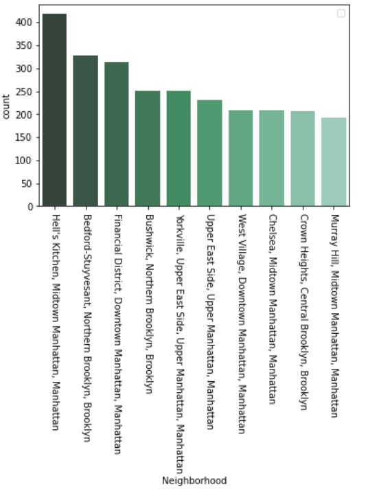

# Apartments-Listings-NYC-Analysis-and-Modeling

# Find somewhere to lay your head in the city that never sleeps. Make better decision for affordable apartment hunt in NYC based on data. 

## Introduction

For international students it is hard to manage their finances is USA. Especially, when your parents are not super rich and your are not allowed to work more then 20 hours a week. 

Affordable and convenient accommodation is a basic requirement to live in States. As my university is in NJ (Drew University, Madison NJ) and I planing to do summer internship in New York City. It would require me to move to NYC, as commuting from NJ would be a time consuming and less effective. Hence, I decided to support my decision for apartment hunt with data analysis and machine learning modeling. 

For understating of NYC neighborhoods: Read [here](https://www.moneyunder30.com/renting-in-nyc).

## Project Structure 
The directory structure of project [here](https://github.com/DoctorDatah/NYC-Apartments-Listings-Analysis-and-Modeling/blob/master/PROJECT_STRUCTURE.MD).

## Data Source

My first concern was how can I get the data for such analysis?
Well, I decided to scrap web for gathering relevant data. Most websites (like listed below) have strict rules for web scarping. Obviously, because of the reason that they don't want others to take competitive advantage from their data.  
-	streeteasy.com  
-	cityrealty.com  
-	zillow.com 

Many popular websites have their APIs available.  
- [zillow.com](zillow.com/howto/api/faq.htm) 
It impose some limitations like: access to only historical data and limited number of API calls.  
- [realtor.com](https://www.realtor.com/)  
Also a good source for the data with different paid plans.

Anyways, if its on the web then its accessible either easily or a hard way. Moreover,I found a real estate website [renthop.com](renthop.com) who's design is simple enough for web scraping.

Do you wonder is scrapping legal to do so? Cases in which its illegal: Read [here](_docs/Is-web-scraping-legal-2.pdf).

#### Website Inference

## Data
- Url 
- Address
- Neighborhood 
- Number of Beds
- Number of Baths 
- Rent in dollars

More Data
- Zip codes of areas are acquired using **Google maps API** calls. 

## Initial Data Prepossessing
*Flexes* have large number of missing values. In this case it means the apartment have no flex at all. In addition, we can see a couple of missing addresses. Which could be most probably because of a few scrapping anomalies, Assuming that website would not allow to post a listing without adding the address first. 

After getting related zip codes from Google Maps API. We lost many instances because we are unable to get corresponding zip codes. If we look at the interface of website we can find that the reason behind is that we are not parsing individual listing pages, we are parsing  pages which only consists of listings overview. And when the address is larger in length then it is squeezed down like "*2728, upper east side, .... NY*". 

 

**Remedy:** Improve data capturing process. 
For now we should proceed, even though it could add some hidden bias in the model. However, we can come up with the base setup, which can be improved in further iterations.
 

## Exploratory Data Analysis 

### Probability Distribution function
Rent seems to be right skewed.

 

Most of the data lies with 94% quantile

 

We do not need to transform rent as it a *label variable*. 

 

Number of Beds, baths, and flexes are ordinal categorical features. Zip-codes are Nominal categorical feature.

#### Top 10 places with most listings 

Hell's kitchen, Midtown Manhattan has most listings.

#### Mean rent at the neighborhoods
Bronx and queens have some neighborhoods with cheap rental. However, inquires from a few Newyorkers and searching online I found these areas have high crime rate. 

Furthermore, places like *Theater District, Midtown Manhattan* and *Hudson Square, SoHo, Downtown Manhattan* are very expensive.

Some places are super expensive as their Mean rent exceeds $6000

**Neighborhoods with mean rent more then $6000**

#### Rental By Zip Codes
Rent ranges from $785  to $10353. Mostly rent is between $2000 to $4200 range on average. With very few number of listings on extreme. 

#### Map (Average rent):

Areas with average above $6000 are excluded (only for maps). As they are outliers and more expensive then usual. They makes map a little difficult to interpret affordable apartments, as the color legend stretches to the limit of these oultilers.

We can observe that Manhattan is Expensive then other boroughs.

#### **Manhattan** (neighborhoods):

Midtown Manhattan and Upper East Side are expensive as compare to Upper Manhattan.

*Black shaded regions means we either don't plot on that areas or we don't have related data.*

## Percentage difference of rent (On Average)
- Upper Manhattan 3.7% Cheaper then Upper East Side
- Midtown is 3.9% Expensive then Upper East Side
- Down down in 4.2% Cheaper then Mid town on Average
- Upper Manhattan 4.2% cheaper then Down Town Manhattan

## Modeling 

|  Model | Parameters | RMSE  |  Feature |  Details |
|---|---|---|---|---|
| LassoReg  |   alpha=0.1|2344  |All   | - |
| LassoReg  |   alpha=0.16|2343  |All   | RandomSearchCV  |
| LassoReg  |   alpha=0.16|2281  |Only Beds and Zips   | - |
| LassoReg  |   alpha=0.73|2238  | Poly Degree 2  | RandomSearchCV  |
| LassoReg  |   alpha=0.38|2769  | Poly Degree 5  | RandomSearchCV  |
| LassoReg  |   alpha=0.004|2222  | Poly Degree 3  | RandomSearchCV  |
|Decision Tree   |   mdepth=40, mfeature=4|2629  | Only Beds and Zips  | -  |
|Decision Tree   |   mdepth=50, mfeature=15|2273  | Only Beds and Zips  | -  |
|Decision Tree   |   mdepth=40, mfeature=4|2510  | All  | -  |
|Decision Tree   |   mdepth=100, mfeature=11|2347  | All  | -  |
|SVM   |epsilon=1.5,C=1   | 3037  | All  | -  |
|SVM   |epsilon=1.5,C=31   | 2609  | All  | RandomSearchCV  |
|Ensemble -Voting   | Best parameters from above  |  2189 | All  | SVM, DTree, Lasso, Random Forest   |
|Ensemble -Voting   | Best parameters from above  |  2189 | Only Beds and Zips  | SVM, DTree, Lasso, Random Forest   |
|Ada-Boost   | On Ensemble -Voting   | 2482  | All  | -  |
|Ada-Boost   | On lasso | 3658  | All  | -  |
|Ensemble -Voting   | Best parameters from above  |  2236 | Reduced Dim -PCA  | SVM, DTree, Lasso, Random Forest   |
|Ada-Boost   | On Ensemble -Voting | 2230  | Reduced Dim -PCA   | -  |
|Ensemble -Voting   | Best parameters from above  |  2444 | Without zip-code  | SVM, DTree, Lasso, Random Forest   |
|Ada-Boost   | On Ensemble -Voting | 2527  | Without zip-code    | -  |

#### Testing 
Ensemble model with lasso, decision tree, SVM, Random forest. Perfroms better from all. With Testing RMSE of $2288. 

## Conclusion 

So far, we have modeled the relationship between the Zip-codes and number of bedrooms, baths and flexes with rental price. We had minimal features to correctly examine the complex real-estate valuation. Low RMSE of the model could possibly because of omitted variable bias i.e. there are dozens of other feature that are significant in rental price but are not present in data.

However, Fortunately, if we were to add more features and data to the model then we can use the exact same framework to expand our analysis.

Some possible future extensions could be utilizing the data from various APIs for restaurants or bars available in the area, walk-ability, transportation proximity measures. That could be signification driver of prices in the areas. 

For my decision, I am looking forward to Hoboken City neighborhoods. As they are not as expensive as NYC, easily commutable and nice.

For latest analysis, all notebooks can be re-executed to fetch the latest data from web and providing up to date insights. 

**END** 